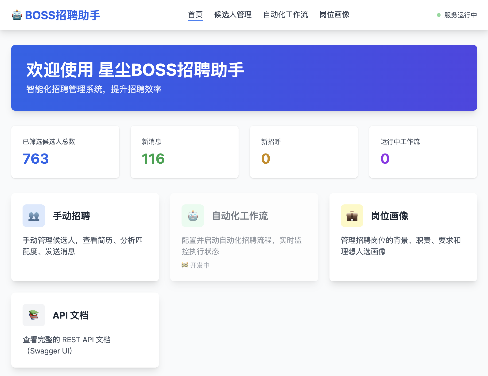
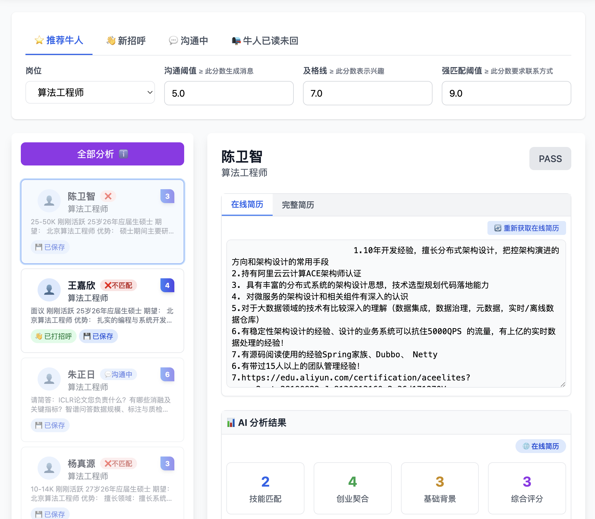
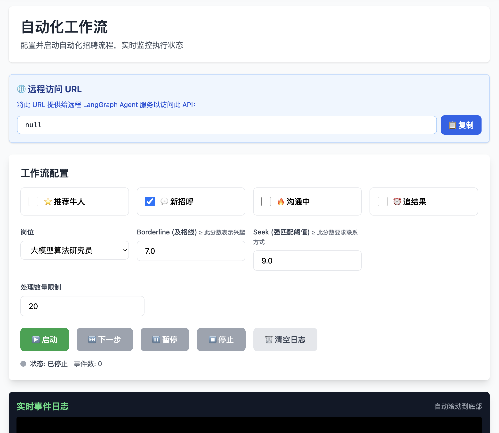
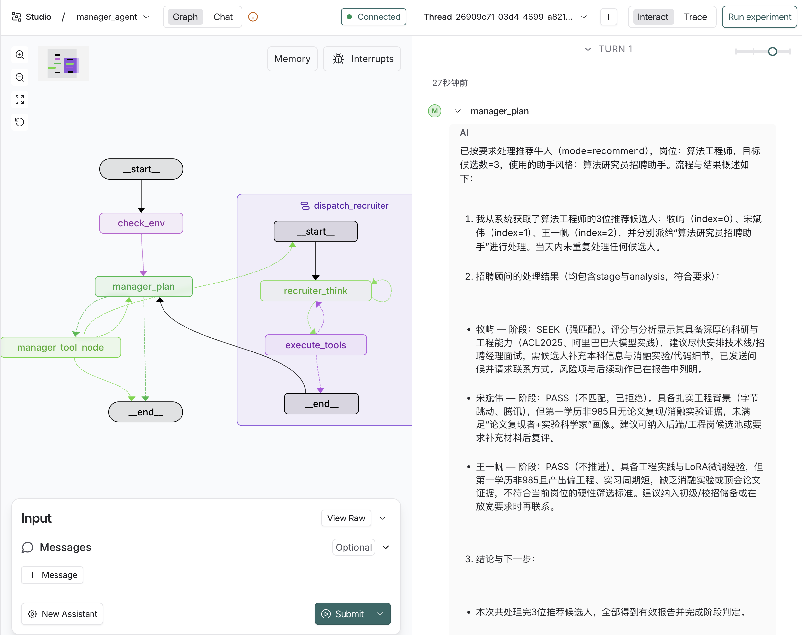

# BOSS招聘助手

**BOSS招聘助手**是一个基于 **AI 人工智能技术**的智能招聘管理系统，旨在通过**半、全自动化**的方式帮助 HR 和招聘经理大幅提升招聘效率，将人力资源从重复性工作中解放出来，专注于高价值的沟通和决策。

## 🎯 项目简介

### 🤖 AI 的核心作用

本系统充分利用 **OpenAI GPT 模型**的强大能力，实现招聘流程的智能化：

1. **智能简历分析**
   - AI 自动解析候选人简历，从技能匹配度、创业契合度、基础背景等多个维度进行深度分析
   - 基于岗位画像和关键词进行智能匹配和评分
   - 自动生成个性化的分析报告和跟进建议

2. **智能消息生成**
   - AI 根据岗位要求和候选人简历自动生成个性化沟通消息
   - 支持多轮对话的上下文理解，生成连贯的跟进消息
   - 消息内容针对性强，能够有效挖掘候选人细节，提高回复率

3. **智能决策支持**
   - 基于 AI 评分自动判断候选人匹配度
   - 根据预设阈值自动执行相应操作（发送消息、请求简历、获取联系方式等）
   - 为 HR 提供数据驱动的决策依据

4. **智能通知系统**
   - 当发现优质候选人时，自动发送 DingTalk 通知
   - 通知包含完整的 AI 分析结果，帮助 HR 快速决策

5. **Agent 智能体系统**（全自动化模式）
   - 基于 LangGraph 构建的双 Agent 架构
   - Manager Agent 负责整体流程编排和任务管理
   - Recruiter Agent 负责单个候选人的深度处理和决策
   - Agent 可以自主规划、决策和执行，实现完全自动化的招聘流程
   - 支持智能工具调用、错误恢复和自适应工作流

### 🎯 项目目标

- **提升效率**：通过 AI 自动化处理，将 HR 从大量重复性工作中解放出来
- **提高质量**：AI 智能分析确保筛选标准的一致性，减少人为偏差
- **降低成本**：减少人工筛选时间，提高招聘 ROI
- **人机协作**：AI 负责数据处理和初步筛选，HR 负责关键决策和深度沟通

### 💡 工作模式

系统提供两种工作模式，满足不同场景的需求：

#### 1. 半自动化模式（候选人管理页面）
- **AI 自动完成**：简历分析、评分计算、消息生成、自动发送、状态更新
- **HR 负责决策**：阈值设置、最终筛选、深度沟通、关系维护
- **适用场景**：HR 需要实时监控和精细化管理候选人

#### 2. 全自动化模式（Agent 智能体系统）
- **AI Agent 自主决策**：基于 LangGraph 构建的智能体系统，能够自主规划、决策和执行招聘流程
- **双 Agent 架构**：
  - **Manager Agent（管理智能体）**：负责整体流程编排、候选人池管理、任务分配
  - **Recruiter Agent（招聘顾问智能体）**：负责单个候选人的深度处理，包括简历分析、消息生成、对话管理
- **智能工具调用**：Agent 可以自主调用各种工具（获取候选人、分析简历、发送消息、请求联系方式等）
- **自适应工作流**：根据候选人状态和岗位要求，动态调整处理策略
- **错误恢复**：具备自动错误检测和恢复能力，确保流程稳定运行
- **适用场景**：需要大规模自动化处理，减少人工干预的场景

两种模式相互补充，既保证了效率，又保留了 HR 的专业判断和人性化沟通。

---

## 📋 目录

1. [快速开始](#快速开始)
2. [界面功能详解](#界面功能详解)
3. [API 文档](#api-文档)
4. [项目结构](#项目结构)
5. [技术栈](#技术栈)
6. [配置说明](#配置说明)
7. [常见问题](#常见问题)
8. [开发指南](#开发指南)

---

## 快速开始

### 方法一：使用 HR 安装脚本（推荐）

向 HR 分发时，可直接发送单文件脚本 `install_hr.command`：

#### 在 macOS 上运行 .command 文件

**方式 A：通过 Finder 双击运行（推荐）**

1. **添加执行权限**
   
   首次使用前，需要在终端中为文件添加执行权限：
   
   ```bash
   chmod +x install_hr.command
   ```
   
   或者使用完整路径：
   ```bash
   chmod +x ~/Downloads/install_hr.command
   ```

2. **双击运行**
   
   - 在 Finder 中找到 `install_hr.command` 文件
   - 双击文件即可运行
   - 如果系统提示"无法打开，因为来自身份不明的开发者"，请：
     - 打开"系统偏好设置" → "安全性与隐私"
     - 点击"仍要打开"按钮

**方式 B：通过终端运行**

1. **打开终端**
   
   按 `Command + 空格键`，输入"终端"或"Terminal"，然后按回车

2. **导航到文件所在目录**
   
   ```bash
   cd ~/Downloads  # 根据实际文件位置调整路径
   ```

3. **添加执行权限（如未添加）**
   
   ```bash
   chmod +x install_hr.command
   ```

4. **运行脚本**
   
   ```bash
   ./install_hr.command
   ```

#### 安装流程说明

运行 `install_hr.command` 后，脚本会自动执行以下步骤：

1. **检查并安装依赖**
   - 自动安装 `uv`（Python 包管理器）
   - 使用 `uv` 安装 Python 3.13

2. **克隆/更新代码仓库**
   - 如果目录不存在，会克隆仓库到 `~/bosszhipin_bot`
   - 如果目录已存在，会**丢弃所有本地修改**并拉取最新代码

3. **创建虚拟环境**
   - 自动创建 `.venv_hr` 虚拟环境
   - 安装所有 Python 依赖包

4. **配置环境**
   - 自动读取并生成 `.env` 和 `config/secrets.yaml` 文件
   - 使用预设的默认配置（OpenAI、Zilliz、DingTalk、Sentry 等）
   - 如果配置文件已存在，会保留现有配置

5. **启动服务**
   - 自动启动 Boss 招聘服务
   - 服务运行在 `http://127.0.0.1:5001`
   - Chrome 浏览器会自动弹出（CDP 模式）

**重要提示：**
- 首次启动 Chrome 时，需要在自动弹出的 Chrome 窗口中登录 Boss直聘账号
- 保持 Chrome 窗口打开，不要关闭
- 如果 Chrome 崩溃或关闭，重新运行安装脚本即可

### 方法二：手动安装

#### 1. 安装依赖

```bash
pip install -r requirements.txt
```

#### 2. 配置文件

编辑 `config/config.yaml` 和 `config/secrets.yaml`

#### 3. 启动 Chrome (CDP模式)

```bash
# macOS
/Applications/Google\ Chrome.app/Contents/MacOS/Google\ Chrome --remote-debugging-port=9222 --user-data-dir=/tmp/chrome_debug

# Linux
google-chrome --remote-debugging-port=9222 --user-data-dir=/tmp/chrome_debug

# Windows
chrome.exe --remote-debugging-port=9222 --user-data-dir=C:\temp\chrome_debug
```

#### 4. 启动服务

```bash
python start_service.py
```

服务地址: `http://127.0.0.1:5001`

#### 5. 访问 Web UI

打开浏览器访问: `http://127.0.0.1:5001`

---

## 界面功能详解

### 1. 首页

**访问路径：** `http://127.0.0.1:5001`



**功能说明：**

- **快速统计卡片**
  - 显示系统统计数据（候选人数量、对话数量等）
  - 数据自动刷新
  - 包括：已筛选候选人总数、新消息、新招呼、运行中工作流

- **功能入口卡片**
  - **手动招聘**：进入候选人管理界面
  - **自动化工作流**：配置和启动 Agent 智能体自动化流程
  - **岗位画像**：管理招聘岗位信息
  - **API 文档**：查看完整的 REST API 文档

- **更新日志**
  - 显示系统最近的版本更新信息
  - 从 `changelog.md` 自动读取最新版本信息

**使用建议：**
- 首次使用建议先配置"岗位画像"，定义招聘需求
- 然后进入"手动招聘"查看和管理候选人
- 配置完成后可启动"自动化工作流"进行全自动化处理

---

### 2. 手动招聘（候选人管理）- AI 辅助半自动化招聘

**访问路径：** `http://127.0.0.1:5001/candidates`



**功能说明：**

这是系统的核心功能模块，采用 **AI 辅助半自动化**的方式帮助 HR 和招聘经理高效完成候选人筛选和管理工作。

#### 🎯 AI 辅助的核心价值

本页面通过 AI 技术实现了招聘流程的**半自动化**，大幅提升招聘效率：

1. **智能简历分析**
   - AI 自动分析候选人简历，从技能匹配度、创业契合度、基础背景等多个维度进行评分
   - 自动识别候选人的优势、劣势，并提供个性化的跟进建议
   - 根据岗位画像中的关键词进行智能匹配和评分

2. **自动化工作流**
   - 点击"全部分析"按钮后，系统会自动完成：
     - 简历抓取和解析
     - AI 智能分析评分
     - 根据匹配度阈值自动生成个性化消息
     - 自动发送招呼或跟进消息
     - 自动请求完整简历（当匹配度达到及格线时）
     - 自动请求联系方式（当匹配度达到强匹配阈值时）
   - HR 只需设置阈值，系统即可自动执行筛选和沟通流程

3. **智能消息生成**
   - AI 根据岗位要求和候选人简历自动生成个性化消息
   - 消息内容针对性强，能够有效挖掘候选人细节
   - 支持多轮对话的上下文理解，生成连贯的跟进消息

4. **智能通知系统**
   - 当候选人匹配度超过及格线时，自动发送 DingTalk 通知给 HR
   - 通知包含完整的分析结果和跟进建议，帮助 HR 快速决策

5. **数据驱动决策**
   - 所有候选人数据自动保存到云端
   - 支持历史记录查询和数据分析
   - 通过匹配度分数和阶段标签，快速识别优质候选人

**工作模式：**
- **半自动化**：系统自动完成重复性工作（分析、评分、消息生成），HR 负责关键决策（阈值设置、最终筛选）
- **人机协作**：AI 提供数据和建议，HR 基于专业判断做出最终决策
- **效率提升**：将 HR 从大量重复性工作中解放出来，专注于高价值的沟通和决策

#### 2.1 标签页说明

界面顶部有四个标签页，分别对应不同的候选人来源：

- **⭐ 推荐牛人**
  - 显示 Boss直聘系统推荐的候选人
  - 可以查看简历、分析匹配度、发送招呼

- **👋 新招呼**
  - 显示主动向您发送消息的候选人
  - 可以查看简历、分析匹配度、回复消息

- **💬 沟通中**
  - 显示正在沟通的候选人
  - 可以查看对话历史、发送消息、请求完整简历

- **📭 牛人已读未回**
  - 显示已读但未回复的候选人
  - 可以发送跟进消息

#### 2.2 筛选条件

- **岗位选择**
  - 从下拉菜单中选择要筛选的岗位
  - 不同岗位对应不同的岗位画像和筛选条件

- **沟通阈值**
  - 默认值：5.0
  - 含义：匹配度 ≥ 此分数时，系统会生成自动消息
  - 范围：1.0 - 10.0

- **及格线**
  - 默认值：7.0
  - 含义：匹配度 ≥ 此分数表示候选人有兴趣
  - 范围：1.0 - 10.0

- **强匹配阈值**
  - 默认值：9.0
  - 含义：匹配度 ≥ 此分数时，系统会要求获取联系方式
  - 范围：1.0 - 10.0

#### 2.3 候选人列表（左侧）

- **查询候选人**
  - 点击"🔍 查询候选人"按钮加载候选人列表
  - 列表会根据当前标签页和筛选条件显示候选人
  - 列表按 `updated_at` 字段降序排列（最近更新的在前）

- **候选人卡片**
  - 显示候选人姓名、头像、匹配度分数
  - 显示候选人状态（已分析、已发送消息等）
  - 点击卡片可在右侧查看详细信息

- **全部分析按钮**（AI 自动化核心功能）
  - 当选择候选人后，会显示"全部分析"按钮
  - 点击后，**AI 系统会自动处理所有候选人**，实现真正的半自动化招聘：
    1. **自动加载在线简历**（如未加载）- AI 自动抓取和解析
    2. **自动初始化对话**（如未初始化）- 为后续 AI 消息生成做准备
    3. **AI 智能分析**（如未分析）- 多维度评分和匹配度计算
    4. **智能决策与执行**：
       - 匹配度 ≥ 沟通阈值：AI 自动生成个性化消息并发送
       - 匹配度 ≥ 及格线：自动请求完整简历，重新分析，并发送 DingTalk 通知
       - 匹配度 ≥ 强匹配阈值：自动请求联系方式
       - 匹配度 ≤ 4.0：自动 PASS 低分候选人（仅在推荐模式下）
    5. **自动更新状态** - 候选人卡片实时反映处理进度和结果
    6. **智能 PASS 功能**：
       - 支持在推荐模式下 PASS 不合适的候选人
       - AI 判断为不合适时（返回 `<PASS>: 理由`），系统自动执行 PASS 操作
       - 候选人卡片自动移除（带淡出动画效果）
  - **效率提升**：一次点击即可完成数十个候选人的筛选和初步沟通，将 HR 从重复性工作中解放出来

#### 2.4 候选人详情（右侧）

点击左侧候选人卡片后，右侧会显示详细信息：

- **基本信息**
  - 姓名、头像、匹配度分数
  - 工作经历、教育背景

- **简历标签**
  - 显示系统自动提取的标签
  - 可以手动编辑标签

- **AI 分析结果**（智能评分系统）
  - **自动分析**：AI 基于岗位画像和候选人简历进行深度分析
  - **多维度评分**：
    - 技能匹配度（0-10分）：评估技术能力和经验匹配度
    - 创业契合度（0-10分）：评估抗压能力、工作热情、适应性
    - 基础背景（0-10分）：评估学历、逻辑思维能力
    - 综合评分（0-10分）：加权综合评分，用于决策
  - **智能建议**：
    - 分析总结：AI 自动生成的候选人评估报告
    - 跟进建议：针对性的沟通策略和跟进要点
  - **自动通知**：当综合评分超过及格线时，自动发送 DingTalk 通知给 HR，包含完整的分析结果

- **对话历史**
  - 显示与候选人的所有对话记录
  - 可以查看消息发送时间、内容

- **操作按钮**
  - **查看在线简历**：在浏览器中打开候选人的在线简历
  - **查看完整简历**：下载并查看候选人的完整简历（附件）
  - **生成消息**：使用 AI 生成个性化消息
  - **发送消息**：向候选人发送消息
  - **请求简历**：向候选人请求完整简历
  - **PASS 候选人**：标记候选人为不合适（推荐模式和聊天模式均支持）

**使用流程（AI 辅助半自动化）：**

1. **设置自动化规则**：选择岗位和设置阈值（沟通阈值、及格线、强匹配阈值）
2. **选择候选人来源**：选择标签页（推荐牛人/新招呼/沟通中/牛人已读未回）
3. **加载候选人列表**：点击"查询候选人"按钮
4. **一键自动化处理**（推荐）：
   - 点击"全部分析"按钮
   - AI 系统自动完成所有候选人的分析、评分、消息生成和发送
   - 系统根据阈值自动决策和执行相应操作
   - 当匹配度超过及格线时，自动发送 DingTalk 通知
5. **查看处理结果**：
   - 点击候选人卡片查看 AI 分析详情
   - 查看自动生成的消息和对话历史
   - 根据 AI 评分和建议做出最终决策
6. **手动精细化管理**（可选）：
   - 对于特殊候选人，可以手动生成消息或调整沟通策略
   - 查看完整的 AI 分析报告和跟进建议

---

### 3. 数据查询

**访问路径：** `http://127.0.0.1:5001/search`


**功能说明：**

数据查询页面允许团队成员通过多条件组合快速筛选候选人，并在同一界面完成概览与详情查看，方便团队协作和信息共享。

#### 3.1 筛选条件（全部为 AND 关系，可单独使用）

- **基础条件**：姓名、岗位、阶段（PASS/GREET/CHAT/SEEK/CONTACT）、DingTalk 通知状态
- **评分阈值**：设置 AI 综合得分的最低值（0-10），仅保留达到阈值的候选人
- **日期范围**：通过日期选择器筛选 `updated_at`（起/止支持独立设置，自动转换为 ISO 时间段）
- **简历关键词**：在在线/完整简历文本中执行大小写不敏感的关键字匹配
- **语义搜索**：输入自然语言描述（例如“近期 NLP 算法工程师”），系统使用向量检索定位最相关的候选人，并继续应用上述筛选条件

#### 3.2 结果列表

- **表格视图**：姓名、岗位、匹配度、阶段、通知状态、在线简历、完整简历，点击列头即可切换升/降序（默认 `updated_at DESC`）
- **简历可用性**：表格中显示 ✅/❌ 图标，快速识别候选人是否已有在线简历或完整简历
- **更新时间提示**：鼠标悬停在表格行上可查看最后更新时间
- **结果数量控制**：可自定义每次查询返回的候选人数量（默认 100，最大 500）
- **无分页模式**：一次最多返回指定数量的结果，适合人工分析与批量对比
- **行交互**：点击任意行会在右侧详情面板中加载该候选人，且不会触发自动 `process_candidate()` 流程，完全只读安全

#### 3.3 详情面板

- 复用 `candidate_detail.html` 模板，但以 `view_mode=readonly` 渲染，禁用自动分析/批处理逻辑
- 可查看在线/完整简历、AI 分析结果、自动生成消息等全部信息
- 详情页头部显示最后更新时间，方便查看数据新鲜度
- 与左侧表格联动，支持多次切换
- **响应式布局**：列表与详情区域比例 3:7，屏幕宽度不足时自动切换为上下布局

#### 3.4 查询条件持久化

- **自动保存**：所有查询条件自动保存到浏览器 localStorage
- **URL 同步**：查询参数同步到 URL，支持书签和分享链接
- **自动恢复**：刷新页面后自动恢复上次的查询条件并执行查询
- **一键重置**：重置按钮可清除所有保存的条件和 URL 参数

#### 3.5 使用场景与注意事项

- **团队协作**：HR、用人经理、运营同事可以共享候选人池的实时状态
- **数据回顾**：快速检索历史候选人，按照时间/阶段回放进度
- **语义检索**：在不知道候选人姓名的情况下，根据描述快速定位潜在人选
- **只读模式**：该页面不执行自动化操作；需要对候选人执行操作时，请在"候选人管理"页面处理
- **性能优化**：简历关键词和最低匹配度过滤在数据库层执行，提升查询性能

---

### 4. 自动化工作流（Agent 智能体系统）

**访问路径：** `http://127.0.0.1:5001/automation`



**功能说明：**

这是系统的**全自动化核心功能**，基于 **LangGraph Agent 智能体架构**实现完全自主的招聘流程自动化。系统采用**双 Agent 协作模式**，能够像人类招聘顾问一样思考、规划和执行招聘任务。

#### 🤖 Agent 智能体系统架构

**1. Manager Agent（管理智能体）**
- **职责**：整体流程编排和任务管理
- **功能**：
  - 检查系统环境（浏览器状态、岗位数据、助手配置）
  - 根据用户需求规划招聘任务
  - 从招聘网站获取候选人列表
  - 将候选人分配给 Recruiter Agent 处理
  - 监控处理进度和结果
  - 处理错误和异常情况

**2. Recruiter Agent（招聘顾问智能体）**
- **职责**：单个候选人的深度处理
- **功能**：
  - 分析候选人简历和匹配度
  - 根据岗位要求进行多维度评分
  - 生成个性化的沟通消息
  - 管理对话流程和上下文
  - 根据评分自动决定下一步行动（发送消息、请求简历、获取联系方式）
  - 生成处理报告和建议

**3. 智能工具系统**
Agent 可以自主调用以下工具：
- **候选人管理**：获取候选人列表、查看候选人详情
- **简历处理**：查看在线简历、请求完整简历、分析简历内容
- **沟通管理**：查看对话历史、发送消息、生成个性化消息
- **决策支持**：分析简历并评分、判断候选人阶段、生成跟进建议
- **通知系统**：发送 DingTalk 通知给 HR

#### 🎯 Agent 工作流程



**Manager Agent 流程**：
1. **环境检查** → 验证浏览器和服务连接状态
2. **任务规划** → 分析用户需求，确定招聘模式、岗位、数量等
3. **获取候选人** → 从招聘网站获取候选人列表
4. **分配任务** → 将候选人分配给 Recruiter Agent 处理
5. **监控结果** → 收集处理报告，决定是否继续处理下一个候选人
6. **完成总结** → 生成整体处理报告

**Recruiter Agent 流程**：
1. **接收任务** → 从 Manager 接收候选人信息
2. **分析思考** → 基于岗位要求和候选人信息，规划处理策略
3. **执行工具** → 调用相应工具（查看简历、分析、发送消息等）
4. **评估结果** → 根据分析结果判断候选人阶段（PASS/GREET/SEEK）
5. **生成报告** → 向 Manager 汇报处理结果和建议

#### 🧠 AI 决策逻辑

Agent 系统基于以下规则进行智能决策：

- **评分标准**：
  - `overall_score < 7`：标记为 `PASS`（不匹配），结束处理
  - `overall_score >= 7`：标记为 `GREET`（沟通中），发送消息并请求完整简历
  - `overall_score >= 9`：标记为 `SEEK`（强匹配），请求联系方式并通知 HR

- **模式适配**：
  - **推荐牛人（recommend）**：主动打招呼，挖掘候选人兴趣
  - **新招呼（greet）**：深入挖掘简历细节，判断是否符合要求
  - **沟通中（chat）**：继续对话，回答问题，推进流程
  - **跟进（followup）**：发送跟进消息，重新激活对话

- **自适应调整**：根据对话历史和候选人反馈，动态调整沟通策略

#### 3.1 远程访问 URL

- **用途**：提供给远程 LangGraph Agent 服务以访问此 API
- **获取方式**：
  - 如果已配置 Cloudflare Tunnel，会自动显示 URL
  - 如果没有配置，可以使用本地 URL：`http://127.0.0.1:5001`
  - 点击"🚀 启动 Cloudflare Tunnel"可以启动远程访问（需要安装 cloudflared）

#### 3.2 工作流配置

- **工作流类型选择**
  - **⭐ 推荐牛人**：自动处理推荐牛人列表
  - **💬 新招呼**：自动处理新收到的招呼（默认选中）
  - **🔥 沟通中**：自动处理正在沟通的候选人
  - **⏰ 追结果**：自动跟进已读未回的候选人

- **岗位选择**
  - 从下拉菜单中选择要处理的岗位

- **阈值设置**
  - **Borderline（及格线）**：默认 7.0，≥ 此分数表示兴趣
  - **Seek（强匹配阈值）**：默认 9.0，≥ 此分数要求联系方式

- **处理数量限制**
  - 默认值：20
  - 范围：5 - 100
  - 控制单次运行处理的候选人数量

#### 3.3 控制按钮

- **▶️ 启动**：启动自动化工作流
- **⏸️ 暂停**：暂停当前运行的工作流
- **⏭️ 下一步**：手动触发处理下一个候选人（仅在暂停状态下可用）
- **⏹️ 停止**：停止工作流
- **🗑️ 清空日志**：清空事件日志

#### 3.4 实时事件日志

- 显示工作流执行的实时日志
- 日志自动滚动到底部
- 不同级别的日志用不同颜色显示：
  - **信息**：白色
  - **警告**：黄色
  - **错误**：红色
  - **成功**：绿色

#### 🚀 使用流程

1. **配置 Agent 参数**
   - 选择要启用的工作流类型（推荐牛人/新招呼/沟通中/跟进）
   - 选择岗位和助手风格
   - 设置阈值（Borderline/Seek）和处理数量限制

2. **启动 Agent 系统**
   - 点击"启动"按钮，Manager Agent 开始工作
   - Agent 会自动检查环境、获取候选人、分配任务

3. **监控执行过程**
   - 在事件日志中实时查看 Agent 的思考和决策过程
   - 观察 Recruiter Agent 如何处理每个候选人
   - 查看工具调用结果和评分报告

4. **人工干预（可选）**
   - 使用"暂停"按钮暂停 Agent 执行
   - 使用"下一步"按钮手动触发下一个候选人的处理
   - 使用"停止"按钮终止当前工作流

5. **查看结果**
   - Agent 会生成每个候选人的处理报告
   - 最终生成整体处理总结
   - 优质候选人会自动发送 DingTalk 通知

#### ⚡ Agent 系统优势

- **完全自主**：无需人工干预，Agent 可以自主完成整个招聘流程
- **智能决策**：基于 AI 模型进行深度思考，做出合理的招聘决策
- **自适应**：根据实际情况动态调整策略，处理各种异常情况
- **可追溯**：完整记录 Agent 的思考过程和决策依据
- **可中断**：支持人工介入，在关键节点进行人工审核

#### ⚠️ 注意事项

- **环境准备**：确保 Chrome 浏览器已启动并登录 Boss直聘账号
- **首次使用**：建议设置较小的处理数量（5-10个），观察 Agent 工作效果
- **监控建议**：首次运行时建议实时监控事件日志，了解 Agent 的工作方式
- **浏览器状态**：工作流运行期间不要关闭 Chrome 浏览器，否则 Agent 会暂停并提示错误
- **网络连接**：确保网络连接稳定，Agent 需要访问 OpenAI API 和本地服务

---

### 5. 岗位画像

**访问路径：**
- **HR 管理员（本地服务）**：`http://127.0.0.1:5001/jobs`


**说明：**
- HR 管理员使用本地服务进行岗位画像管理
- 非 HR 管理员可以通过公开的 Vercel 链接访问（只读候选人详情、岗位管理与优化工作流），用于协作迭代岗位肖像

**功能说明：**

管理招聘岗位的背景、职责、要求和理想人选画像。这些信息用于 AI 分析候选人的匹配度。

#### 4.1 岗位列表

- 界面顶部显示所有岗位的标签页
- 点击标签页可以切换不同岗位
- 最后一个标签是"➕ 新增岗位"，用于创建新岗位
- 岗位标签按 `updated_at` 字段降序排列（最近更新的在前）

#### 4.2 基本信息

- **岗位 ID**：唯一标识符，创建后不可修改（例如：`python_developer`）
- **岗位名称**：岗位的显示名称（例如：`Python开发工程师`）
- **状态**：岗位的激活状态（仅对已有岗位可见）
  - **激活 (Active)**：岗位处于激活状态，会收到每日报告（Vercel 定时任务）
  - **停用 (Inactive)**：岗位处于停用状态，不会收到每日报告
  - 注意：只更新状态时不会创建新版本，直接修改当前版本

#### 4.3 岗位详情

- **岗位概述**：建议包含公司/产品/团队/核心挑战（部分 UI 可能不单独展示“公司背景”，但系统会保留相关字段）
- **主要职责**：描述岗位的主要职责
- **评分标准（文本）**：用于 AI 分析的稳定口径（总分 100，一行一个评分项）
- **理想人选**：描述理想人选的特征（偏“能力画像/工作产出形态”，避免正确废话）

#### 4.4 追问问题

- 用于面试沟通时进一步确认候选人能力与经历
- 一行一个问题
- 例如：
  ```
  请详细描述你在RLHF项目中的具体职责和贡献？
  你如何评估一个对齐算法的有效性？
  在工程实践中你如何权衡推理性能与成本？
  ```

#### 4.5 候选人筛选条件

- 用于在推荐页面筛选候选人的条件
- **格式**：JSON 格式
- **示例**：
  ```json
  {
    "活跃度": "本周活跃",
    "院校": ["985", "留学"],
    "只看第一学历": true,
    "学历": "硕士",
    "经验": "3-5年",
    "求职意向": ["离职-随时到岗", "在职-考虑机会"],
    "薪资待遇": "20-50K"
  }
  ```
- **功能按钮**：
  - **✨ 格式化**：自动格式化 JSON
  - **✓ 验证**：验证 JSON 格式是否正确

#### 4.6 关键词

- **正向关键词**：希望候选人具备的技能（蓝色标签）
- **负向关键词**：代表扣分的内容，例如初级能力、泛泛而谈、不匹配的能力等（红色标签）

**使用方法：**

1. 在输入框中输入关键词
2. 按回车键或输入逗号/分号添加关键词
3. 点击标签上的 × 可以删除关键词

**使用建议：**

- 正向关键词示例：`Python`、`机器学习`、`深度学习`、`算法`
- 负向关键词示例：`初级`、`泛泛而谈`、`不匹配的能力`（用于标识不符合要求的特征）

#### 4.7 版本管理

岗位支持版本管理功能，每次保存都会创建新版本，保留历史记录。

- **版本切换**
  - 界面右上角显示当前版本号（如：v3）
  - 点击版本号可以查看所有历史版本
  - 选择不同版本可以查看和切换历史版本
  - 切换版本后，该版本会成为当前使用的版本

- **版本删除**
  - 可以删除任意历史版本
  - 删除当前版本时，系统会自动将前一个版本（N-1）设置为当前版本
  - 如果只有一个版本，删除按钮会被禁用（灰色显示）
  - 删除最后一个版本会完全删除该岗位

**使用流程：**

1. 点击"➕ 创建新岗位"或选择已有岗位
2. 填写基本信息（岗位 ID 和岗位名称）
3. 详细填写岗位详情
4. 添加追问问题
5. 配置候选人筛选条件（JSON 格式）
6. 添加正向和负向关键词
7. 对于已有岗位，可以设置状态（激活/停用）来控制是否接收每日报告
8. 点击"保存"（会创建新版本，但只更新状态时不会创建新版本）
9. 如需查看历史版本，点击版本号进行切换

#### 4.8 岗位肖像优化（评分不准 → 生成 → 发布）

为了让岗位肖像能“滚动迭代”（而不是靠感觉修改），系统提供“人类反馈→生成→对比→发布”的闭环：

1. 在候选人详情页点击 **“评分不准”**，填写目标分数与理由（写入 `CN_job_optimizations`）
2. 在岗位页点击绿色 **“优化肖像”** 入口进入 `/jobs/optimize`
3. 勾选若干反馈 → 生成新版（进度条 + 字段级 diff，可编辑）
4. 确认提交后发布新版本，并把已用反馈标记为 `closed`

> 合规要点：AI 不代替 HR 约面试；不讨论薪资等商务条款；PASS 不发消息。

**注意事项：**

- 岗位 ID 创建后不可修改，请谨慎填写
- 候选人筛选条件的 JSON 格式必须正确，可以使用"验证"按钮检查
- 关键词用于 AI 匹配，建议添加准确、相关的关键词
- 每次保存都会创建新版本，旧版本会保留，可以随时切换回历史版本
- 删除版本时，如果删除的是当前版本，系统会自动将前一个版本设置为当前版本
- **状态管理**：设置岗位为"停用"状态后，该岗位将不会收到 Vercel 定时任务发送的每日报告；设置为"激活"状态后，会恢复接收每日报告

---

## API 文档

**访问路径：** `http://127.0.0.1:5001/docs`

查看完整的 REST API 文档（Swagger UI）。

### 核心 API 端点

#### 聊天管理
- `GET /chat/dialogs` - 获取对话列表
- `GET /chat/{chat_id}/messages` - 获取消息历史
- `POST /chat/{chat_id}/send_message` - 发送消息
- `POST /chat/greet` - 发送招呼

#### 简历管理
- `GET /chat/resume/online/{chat_id}` - 查看在线简历
- `GET /chat/resume/full/{chat_id}` - 查看完整简历
- `POST /chat/resume/request_full` - 请求完整简历
- `POST /chat/resume/check_full_resume_available` - 检查完整简历是否可用

#### 推荐牛人
- `GET /recommend/candidates` - 获取推荐候选人列表
- `GET /recommend/candidate/{index}/resume` - 查看推荐候选人简历
- `POST /recommend/candidate/{index}/greet` - 向推荐候选人发送招呼

#### 系统状态
- `GET /status` - 获取服务状态

### 示例

```python
import requests

# 获取对话列表
response = requests.get('http://127.0.0.1:5001/chat/dialogs?limit=10')
dialogs = response.json()

# 发送消息
response = requests.post(
    'http://127.0.0.1:5001/chat/abc123/send_message',
    json={'message': '你好'}
)

# 查看在线简历
response = requests.get('http://127.0.0.1:5001/chat/resume/online/abc123')
resume = response.json()
```

详见 [docs/api.md](docs/api.md) 获取完整 API 文档。

---

## 项目结构

```
├── boss_service.py         # FastAPI 后端服务 + Web UI
├── start_service.py        # 服务启动脚本
├── install_hr.command      # HR 一键安装脚本
├── web/                    # Web UI (FastAPI templates)
│   ├── routes/            # 路由处理
│   │   ├── candidates.py  # 候选人管理路由
│   │   ├── jobs.py        # 岗位管理路由
│   │   └── automation.py  # 自动化工作流路由
│   ├── templates/         # HTML 模板
│   └── static/            # 静态资源
├── agent/                  # Agent 智能体系统
│   ├── graph.py          # LangGraph 工作流定义
│   ├── tools.py          # Agent 工具定义
│   ├── states.py          # 状态管理
│   └── prompts.py         # Agent 提示词
├── config/                 # 配置文件
│   ├── config.yaml        # 非敏感配置
│   └── secrets.yaml        # 敏感配置 (API keys)
├── src/                    # 核心模块
│   ├── chat_actions.py    # 聊天操作
│   ├── recommendation_actions.py  # 推荐牛人操作
│   ├── assistant_actions.py       # AI 助手
│   ├── candidate_store.py         # Zilliz 存储
│   ├── jobs_store.py              # 岗位存储
│   └── config.py          # 配置加载
├── docs/                   # 文档
│   ├── architecture.md    # 系统架构
│   ├── technical.md       # 技术规范
│   └── api.md             # API 文档
└── test/                   # 测试

```

---

## 技术栈

- **后端**: FastAPI + Playwright (CDP 模式)
- **前端**: FastAPI Web UI (Jinja2 templates + Alpine.js/HTMX)
- **AI**: OpenAI GPT-5-mini (Responses API)
- **向量数据库**: Zilliz (Milvus) - 内置 OpenAI 嵌入函数
- **Agent 框架**: LangGraph
- **错误追踪**: Sentry
- **通知系统**: DingTalk Webhook

---

## 配置说明

### config.yaml (非敏感)

```yaml
boss_zhipin:
  chat_url: https://www.zhipin.com/web/chat/index
  base_url: https://www.zhipin.com
  
service:
  host: 127.0.0.1
  port: 5001

browser:
  cdp_url: http://127.0.0.1:9222
```

### secrets.yaml (敏感)

```yaml
openai:
  api_key: sk-...

zilliz:
  endpoint: https://...
  user: ...
  password: ...

dingtalk:
  url: https://oapi.dingtalk.com/robot/send?access_token=...
  secret: ...

sentry:
  dsn: https://...
```

---

## 常见问题

### 1. 如何添加执行权限？

如果双击 `.command` 文件无法运行，需要在终端中执行：

```bash
chmod +x install_hr.command
```

### 2. Chrome 连接失败怎么办？

**检查 Chrome 是否启动：**

```bash
curl http://127.0.0.1:9222/json/version
```

**如果未启动，执行：**

```bash
/Applications/Google\ Chrome.app/Contents/MacOS/Google\ Chrome --remote-debugging-port=9222 --user-data-dir=/tmp/chrome_debug
```

**如果仍然失败，清除缓存后重启：**

```bash
rm -rf /tmp/chrome_debug
# 然后重新启动 Chrome
```

### 3. 服务无法启动怎么办？

1. **检查端口是否被占用：**
   ```bash
   lsof -i :5001
   ```

2. **检查配置文件：**
   - 确认 `.env` 文件存在且配置正确
   - 确认 `config/secrets.yaml` 文件存在且配置正确

3. **查看错误日志：**
   - 在终端中查看服务启动时的错误信息
   - 检查是否有依赖包未安装

### 4. 如何更新代码？

运行 `install_hr.command` 脚本会自动更新代码。脚本会：
- 丢弃所有本地修改
- 拉取最新的代码
- 重新安装依赖（如有更新）

### 5. 登录失效怎么办？

删除登录状态文件并重新登录：

```bash
rm ~/bosszhipin_bot/data/state.json
```

然后重新启动 Chrome 并登录 Boss直聘账号。

### 6. 如何修改服务端口？

编辑 `config/config.yaml` 文件，修改 `service.port` 的值：

```yaml
service:
  host: 127.0.0.1
  port: 5001  # 修改为其他端口
```

### 7. AI 分析不准确怎么办？

1. **检查岗位画像配置：**
   - 确保岗位详情填写完整
   - 确保关键词设置准确

2. **调整阈值：**
   - 在候选人管理界面调整沟通阈值、及格线、强匹配阈值

3. **手动编辑标签：**
   - 在候选人详情页面可以手动编辑标签

### 8. 自动化工作流不工作怎么办？

1. **检查 Chrome 是否运行：**
   - 确保 Chrome 浏览器已启动并登录

2. **检查工作流配置：**
   - 确认已选择工作流类型
   - 确认已选择岗位

3. **查看事件日志：**
   - 在自动化工作流界面查看实时日志
   - 根据错误信息排查问题

### 9. 如何重置系统？

1. **停止服务：**
   - 在终端中按 `Ctrl + C` 停止服务

2. **清除数据：**
   ```bash
   rm -rf ~/bosszhipin_bot/data/state.json
   rm -rf /tmp/chrome_debug
   ```

3. **重新启动：**
   - 重新运行 `install_hr.command`
   - 重新启动 Chrome 并登录

---

## 开发指南

### 运行测试

```bash
pytest test/
```

### 代码风格

```bash
black .
ruff check .
```

### 文档

- [系统架构](docs/architecture.md) - 架构概览和技术细节
- [技术规范](docs/technical.md) - 技术规范和开发指南
- [API 文档](docs/api.md) - REST API 完整参考
- [变更日志](changelog.md) - 版本历史

---

## License

MIT License

## 支持

- GitHub Issues
- Sentry Dashboard (错误追踪)

---

**最后更新：** 2025-12-18  
**版本：** v2.6.1
