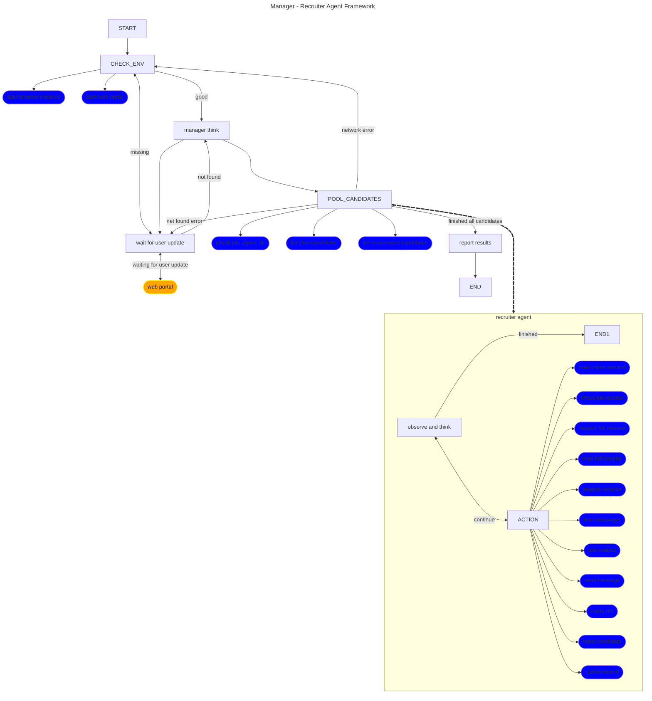

# 招聘助理代理框架

## 概述

1. recruiter manager - recruiter 多代理框架。
2. Manager agent功能包括：
- jobs.yaml 中的职位描述
    - id
    - 职位
    - 关键词
    - 背景
    - 职责
    - 要求
    - ...
- agent.yaml 中的 recruiter 样式:
    - id
    - name
    - instructions
    - ...

- 浏览器实例管理，可与招聘网站(Boss直聘)进行交互。

3. recruiter agent功能包括：
- 从manager agent接收指令(State Dict)，信息包含：
    - job_info: 职位信息
    - agent_info: 招聘者样式
    - chat_id: 聊天ID(用于聊天界面)
    - recommend_id: 推荐ID(用于推荐界面)
- 决定下一步操作（think node），工具：
    - 获取在线简历（read online resume, read_full_resume）
    - 分析简历(analyze resume)
    - 询问联系方式(ask contact)
    - 发送信息(send message)
    - 通知HR(notify HR)
- 返回结果给manager agent
    - 结果包括：完整的对话信息
- ...

## Agent Nodes and Tools Definition


### State Definition
#### Manager agent state:
```json
{
    "browser_endpoint": str, // "http://127.0.0.1:9222",
    "web_portal": str, // "http://127.0.0.1:5001",
    "job": dict,
    "persona": dict,
    "tasks": list[str], //"recommend" | "greet" | "chat" | "followup",
    "candidates": list[dict], // the candidates from the retruiter agent, e.g. [{"name": "John Doe", "resume": "John Doe is a software engineer with 3 years of experience in Python and Java.", "score": 8, "reasoning": "The candidate is a good fit for the job."}]
    "processed_candidates": list[dict], // the candidates that have been processed
}
```

#### Recruiter agent state:
```json
{
    "chat_id": str, // "abc_123",
    "recommend_id": int, // 4,
    "job_info": dict, 
    "agent_info": dict,
    "task": str, // "recommend" | "greet" | "chat" | "followup",
    "candidate": dict, // the candidate from the retruiter agent, e.g. {"name": "John Doe", "resume": "John Doe is a software engineer with 3 years of experience in Python and Java.", "score": 8, "reasoning": "The candidate is a good fit for the job."}
    "analysis": dict, // the result from the retruiter agent, e.g. {"skill": 8, "startup_fit": 7, "background": 9, "overall": 8, "summary": "The candidate is a good fit for the job.", "followup_tips": "You can ask the candidate to provide more details about their experience."}
    "messages": list[dict], //the messages from the retruiter agent, e.g. [{"role": "user", "content": "Hello, how are you?"}, {"role": "assistant", "content": "I'm good, thank you!"}]
    "error": dict, // the error from the retruiter agent, e.g. {"code": 400, "message": "Bad Request", "details": "the website is not responding."}
}
```